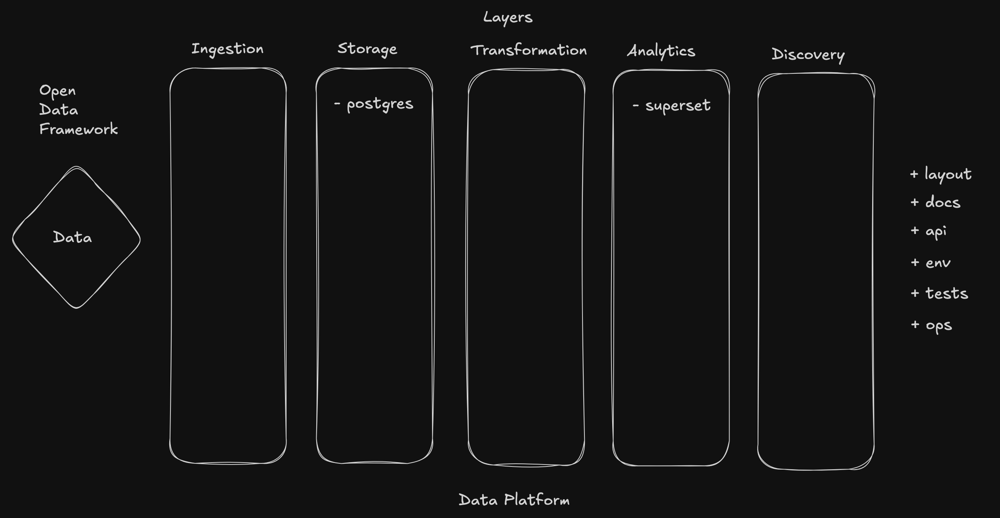

# Open Data Framework
Open source, full stack data framework.

Aims to be a bridge between `data` and `data platform`.

To start, you need to create a `data folder` called `data` with at least one `data file`, for example, `.csv`. 
That file will be used to derive the schema and register an `entity` across `components` selected during `layers` configuration via `CLI` where applicable.

Your project has to be `reproducible` and eventually, `scalable`. The framework heavily relies on `containerization`.
Expected that one of the supported `containerization technologies` is installed on the host.

Supported `containerization technologies`:
- [Docker](https://www.docker.com/)

As an option, pre-configured [devcontainers](https://code.visualstudio.com/docs/devcontainers/containers) are included for:
- R
- Python

Besides configuration of `containerized data platform`, framework enforces usage of:
- project `layouts` (`research`, `custom`, etc.)
- [docs](https://squidfunk.github.io/mkdocs-material/), including a workflow for [gihub pages](https://pages.github.com/)
- [hooks](https://pre-commit.com/)
- [pytest](https://docs.pytest.org/en/stable/)
- [great_expectations](https://github.com/great-expectations/great_expectations)

Projects can be shared and reproduced using `settings.json`.
Code generated by the framework can be used standalone without hard dependency on the framework itself.

For more details, please refer to [documentation](opendataframework.dev/).
