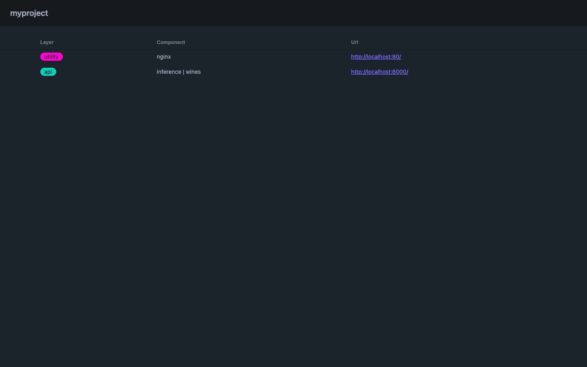
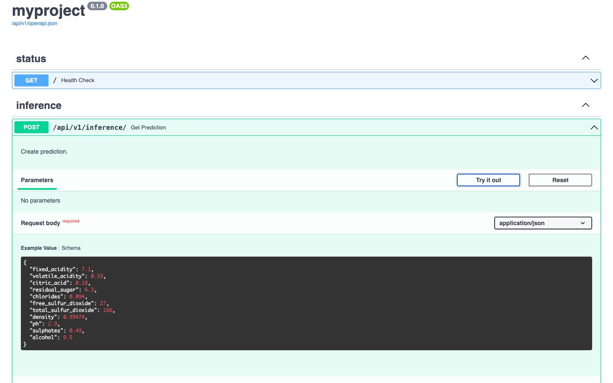

# Open Data Framework
Open source, full stack data framework.

## Installation
<!-- termynal -->

```
$ pip install opendataframework
---> 100%
Installed
```
### Create data folder
> Name (required): `data`

<!-- termynal -->

```
$ mkdir data
```
### Create data file

> Name (can be any): `events.csv`

#### Types supported

> int, float, str, datetime

| id | name    | value  | logged_at           |
| -- | ------- | ------ | ------------------- |
| 1  | noname  | 0.1    | 2024-01-01 00:00:00 |

<!-- termynal -->

```
$ cat > data/events.csv << EOF
id,name,value,logged_at
1,noname,0.1,2024-01-01 00:00:00
EOF

$ tree
.
└── data
    └── events.csv
```

### Init
> Name (can be any): `myproject`

<!-- termynal -->

```
$ opendataframework init myproject --profile research
./myproject/settings.json created

$ tree
.
├── data
│   └── events.csv
└── myproject
    ├── data
    │   └── events.csv
    └── settings.json
```

#### settings.json

<!-- termynal -->

```
$ cat myproject/settings.json
{
  "opendataframework": "0.0.3",
  "project": "myproject",
  "profile": "research",
  "layout": "research",
  "entities": {
    "events": {
      "name": "event",
      "description": "events research",
      "fields": {
        "id": "int",
        "name": "str",
        "value": "float",
        "logged_at": "datetime|%Y-%m-%d %H:%M:%S"
      },
      "layers": {
        "devcontainers": {
          "R": {}
        },
        "utility": {
          "texlive": {}
        }
      }
    }
  },
  "mounts": {
    "R": {
      "workspaceMount": "source=${localWorkspaceFolder},target=/myproject,type=bind",
      "workspaceFolder": "/myproject",
      "mounts": [
        "source=${localWorkspaceFolder}/../../../data,target=/myproject/data,type=bind,consistency=cached"
      ]
    }
  },
  "volumes": {
    "texlive": {
      "../output": "/usr/src/app/mnt/output",
      "../paper": "/usr/src/app/mnt/paper"
    }
  },
  "ports": {}
}

```

### Create
<!-- termynal -->

```
$ opendataframework create myproject
events.csv moved to
./myproject/data/raw/events.csv
myproject: research layout created
./myproject/platform/devcontainers/R created
./myproject/platform/utility/texlive created

$ tree
.
├── data
│   └── events.csv
└── myproject
    ├── README.md
    ├── code
    │   ├── build
    │   ├── check
    │   ├── learn
    │   └── share
    ├── data
    │   ├── derived
    │   └── raw
    │       └── events.csv
    ├── expectations.py
    ├── libraries
    ├── logs
    ├── models
    ├── output
    │   ├── figures
    │   └── tables
    ├── paper
    ├── platform
    │   ├── devcontainers
    │   │   └── R
    │   ├── docker-compose.yaml
    │   ├── setup.sh
    │   └── utility
    │       └── texlive
    │           ├── Dockerfile
    │           └── mnt
    ├── requirements.txt
    └── settings.json
```

### Build platform
Command builds platform's images.

<!-- termynal -->

```
$ opendataframework build --project myproject
```

### Start platform
Command starts platform's containers.

<!-- termynal -->

```
$ opendataframework start --project myproject
```

### Setup platform
Command setup platform's containers.

<!-- termynal -->

```
$ opendataframework setup --project myproject
```

### Install dependencies
Command creates `myproject/.venv/` and installs dependencies from `requirements.txt`.

<!-- termynal -->

```
$ opendataframework install --project myproject
```

## Build from the source
1. This package requires [poetry](https://python-poetry.org/docs/#installation) to be installed in your system first.
> Optional: Set [virtualenvs.in-project](https://python-poetry.org/docs/configuration/#virtualenvsin-project) to `true` by running `poetry config virtualenvs.in-project true` to create `.venv` inside project's folder.
2. Clone [opendataframework](https://github.com/opendataframework/opendataframework).
3. Install `opendataframework` in [editable mode](https://pip.pypa.io/en/stable/topics/local-project-installs/#editable-installs) with dependencies by running: `poetry install`.


## Concepts

### Layout
Predefined project layout and scripts to get up & running.

#### Research

```
.
├── code
│   ├── build
│   ├── check
│   ├── learn
│   └── share
├── data
│   ├── derived
│   └── raw
├── libraries
├── logs
├── models
├── output
│   ├── figures
│   └── tables
└── paper
```

#### Custom
> No Layout (default)

### Platform
Data platform. Set of pre-configured, open source, containerized tools used in project, hosted locally or deployed.

#### Layers & Components
Layers of data platform with containerized components.

##### analytics
###### [superset](https://superset.apache.org/)

##### api
###### [fastapi](https://fastapi.tiangolo.com/)

##### devcontainers
###### [python](https://www.python.org/)
###### [R](https://www.r-project.org/)

##### storage
###### [postgresql](https://www.postgresql.org/)

##### utility
###### [nginx](https://nginx.org/en/)
###### [TeX Live](https://hub.docker.com/r/texlive/texlive)

### Profile
Pre-configured layout & data platform.

#### Research
> Configuration for `Research` project.

#### Custom
> Manual configuration via CLI.


## Examples
### Inference API
We need 3 files in order to make predictions via API

1. `data file` (`wines.csv`) is needed to prepare schema for `Inference API`
2. `model file` (`model.pkl`) is needed to make a prediction via `Inference API`
3. `requirements.txt` is needed to install extra dependencies needed for our model (for example `scikit-learn`)

#### Create data folder
> Name (required): `data`

<!-- termynal -->

```
$ mkdir data

$ tree
.
└── data
```

#### Create data file
> Assume, we have a `model` and it was `trained` and `fit` using the [dataset](https://archive.ics.uci.edu/dataset/186/wine+quality)

> `quality` is a column we want to predict

Now, lets create a `data file`

- `data file` can be used for prediction
- inference endpoint will be generated based on `data file` schema

> Name (can be any): `wines.csv`

> File should contain column names used to `fit` the model

> Column used to `train` the model, but not to `fit` the model (`quality`), will be predicted by inference endpoint

> <b>Note</b>: column types supported are `int`, `float`, `str`, `datetime`

<!-- termynal -->

```
$ cat > data/wines.csv << EOF
"fixed acidity","volatile acidity","citric acid","residual sugar","chlorides","free sulfur dioxide","total sulfur dioxide","density","pH","sulphates","alcohol"
7.1,0.33,0.18,6.3,0.094,27,166,0.99474,2.9,0.49,9.5
EOF

$ tree
.
└── data
    └── wines.csv
```

`wines.csv`

| fixed_acidity | volatile_acidity | citric_acid  | residual_sugar  | chlorides  | free_sulfur_dioxide | density  | ph      | sulphates | alcohol |
| ------------- | ---------------- | ------------ | --------------- | ---------- | ------------------- | -------- | ------- | -- | --- |
| 7.1           | 0.33             | 0.5          | 6.3             | 0.094      | 27                  | 166      | 0.99474 | 0.49 | 9.5 |


#### Create models folder
> Name (required): `models`
> Model folder (must correspond to the `data file name`): `wines`

<!-- termynal -->

```
$ mkdir -p models/wines

$ tree
.
├── data
│   └── wines.csv
└── models
    └── wines
```

#### Create model file
Add a model file into correspondent folder.

> Name (required): `model.pkl`

<!-- termynal -->

```
$ tree
.
├── data
│   └── wines.csv
└── models
    └── wines
        └── model.pkl
```

#### Add dependencies
Dependencies are the packages required for our model to be able to work.

> Assume our model requires `scikit-learn==1.5.2`
```
$ cat > models/wines/requirements.txt << EOF
scikit-learn==1.5.2
EOF

$ tree
.
├── data
│   └── wines.csv
└── models
    └── wines
        ├── model.pkl
        └── requirements.txt
```

#### Init project
> Name (can be any): `myproject`

<!-- termynal -->

```
$ opendataframework init myproject

```

Now, lets do manual configuration of `myproject`.

The only components we need to select are:
> `inference` (required)

> `nginx` (optional) - to make a simple static UI for our app where we can easily find the link to Inference API

<!-- termynal -->

```
- Layout (custom): custom
- Name (wine): wine
- Plural (wines): wines
- Description: wine quality prediction

  wine | analytics
  superset: n

  wine | devcontainers
  python: n
  R: n

  wine | api
  api-postgres: n
  inference: y

  wine | storage
  postgres: n

  wine | utility
  nginx: y
  texlive: n
```

> <b>What happened?</b>

> 1. Required folders were copied to `myproject` folder

> 2. Configuration file `myproject/setting.json` was created

<!-- termynal -->

```

$ tree
.
├── data
│   └── wines.csv
├── models
│   └── wines
│       ├── model.pkl
│       └── requirements.txt
└── myproject
    ├── data
    │   └── wines.csv
    ├── models
    │   └── wines
    │       ├── model.pkl
    │       └── requirements.txt
    └── settings.json
```

#### Create project
Since we are going to use defult cofiguration defined in `myproject/setting.json` lets go ahead and create the project.

<!-- termynal -->

```
$ opendataframework create myproject

```

Now, lets switch to `myproject` folder and look what is inside.

<!-- termynal -->

```
$ cd myproject

$ tree
.
├── README.md
├── data
│   └── wines.csv
├── docs
│   ├── index.md
│   └── stylesheets
│       └── extra.css
├── expectations.py
├── ingest.py
├── mkdocs.yml
├── models
│   └── wines
│       ├── model.pkl
│       └── requirements.txt
├── platform
│   ├── api
│   │   └── inference
│   │       └── wines
│   │           ├── Dockerfile
│   │           ├── app
│   │           │   ├── __init__.py
│   │           │   ├── config.py
│   │           │   ├── crud.py
│   │           │   ├── dependencies.py
│   │           │   ├── main.py
│   │           │   ├── model.pkl
│   │           │   ├── models.py
│   │           │   └── router.py
│   │           └── pyproject.toml
│   ├── docker-compose.yaml
│   ├── setup.sh
│   └── utility
│       └── nginx
│           ├── Dockerfile
│           ├── nginx.conf
│           └── static
│               ├── images
│               │   └── logo.svg
│               └── index.html
├── requirements.txt
├── settings.json
└── tests
    ├── __init__.py
    └── test_example.py
```

#### Build platform

Inside `myproject` run

<!-- termynal -->

```
$ opendataframework build

```

#### Start platform

Inside `myproject` run

<!-- termynal -->

```
$ opendataframework start

```

#### Check status

Inside `myproject` run

<!-- termynal -->

```
$ opendataframework status

NAME                IMAGE               COMMAND                  SERVICE             CREATED             STATUS              PORTS
myproject_nginx     myproject:nginx     "/docker-entrypoint.…"   myproject_nginx     28 seconds ago      Up 26 seconds       80/tcp, 0.0.0.0:80->8080/tcp
myproject_wines     myproject:wines     "uvicorn app.main:ap…"   myproject_wines     30 seconds ago      Up 28 seconds       0.0.0.0:8000->8000/tcp

```

[myproject_nginx](http://localhost:80)
> Simple Frontend Server, serves list of urls registred in `myproject`





[myproject_wines](http://localhost:8000/docs)
> Swagger UI with endpoints





#### Make predictions

Lets make a prediction via API

<!-- termynal -->

```
$ curl -X 'POST' \
  'http://localhost:8000/api/v1/inference/' \
  -H 'accept: application/json' \
  -H 'Content-Type: application/json' \
  -d '{
  "fixed_acidity": 7.1,
  "volatile_acidity": 0.33,
  "citric_acid": 0.18,
  "residual_sugar": 6.3,
  "chlorides": 0.094,
  "free_sulfur_dioxide": 27,
  "total_sulfur_dioxide": 166,
  "density": 0.99474,
  "ph": 2.9,
  "sulphates": 0.49,
  "alcohol": 9.5
}'

```

<b>Response:</b>
5.591486165052446 (`quality` column prediction)
